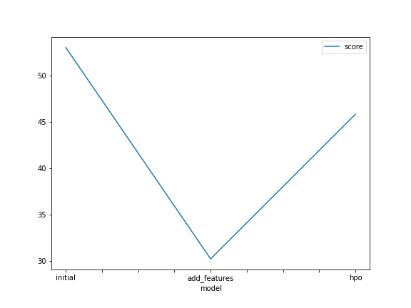
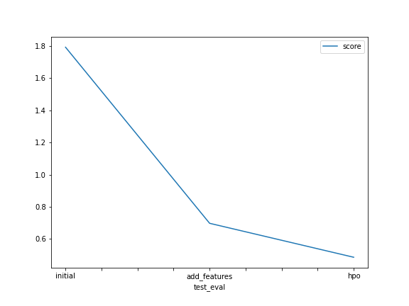

# Report: Predict Bike Sharing Demand with AutoGluon Solution
#### Htet Wai Yan

## Initial Training
### What did you realize when you tried to submit your predictions? What changes were needed to the output of the predictor to submit your results?
The predictions from the AutoGluton are the target column (count) only. We need to match the datetime data from the kaggle sample submission with the predictions so that we will get a format that kaggle approves.

### What was the top ranked model that performed?
The top performed model is 'WeightedEnsemble_L3'.

## Exploratory data analysis and feature creation
### What did the exploratory analysis find and how did you add additional features?
First of all, I split the datetime columns to year, month and day. And I found that "season" and "weather" columns are treated as numerical values. So, I changed them as categorical values. 

### How much better did your model preform after adding additional features and why do you think that is?
It is better after adding the additional features. I think it is because of the date time value. It is better for the regression model to train with year, month, day columns instead of date time columns. 
Here is the performance increasement percentage comparing the first model and the final model.
Increase Percentage = [(0.48595 - 1.79279) / 1.79279] * 100 = -72.81%. It is negative because it actually is a decrease percentage.

## Hyper parameter tuning
### How much better did your model preform after trying different hyper parameters?
The previous score with the additional features was 0.6972, my model with hyper parameters is 0.48595.

### If you were given more time with this dataset, where do you think you would spend more time?
I think I will do some feature engineerings and will try a mix of different hyper parameters to train the model. I would like to see how the model will perform with a very high time_limit intead of just 10 minutes.

### Create a table with the models you ran, the hyperparameters modified, and the kaggle score.
|model|num_epochs|learning_rate|dropout_prob|score|
|--|--|--|--|--|
|initial||default|default|default|1.79279|
|add_features|default|default|default|0.6972|
|hpo|5|ag.space.Real(1e-4, 1e-2, default=5e-4|ag.space.Real(0.0, 0.5, default=0.1)|0.48595|

### Create a line plot showing the top model score for the three (or more) training runs during the project.

TODO: Replace the image below with your own.

### Create a line plot showing the top kaggle score for the three (or more) prediction submissions during the project.

TODO: Replace the image below with your own.

## Summary
I was able to apply all the things I learnt from the course in this project. I am satisfied with the final score since it is my first time entering the kaggle competitions and it is not that bad. I will try to compete in other projects using the concepts I learnt from here.
